# Airbnb Data Pipeline (dbt)


> A production-grade, end-to-end data engineering pipeline built around Airbnb rental data. Raw CSV files are stored in AWS S3, ingested into Snowflake's staging layer via a native S3 external stage, and then transformed through a full medallion architecture: Bronze → Silver → Gold - using dbt-core. The Gold layer delivers a One Big Table (OBT), a Star Schema with SCD Type 2 snapshot dimensions, a Fact table, and Jinja-driven dynamic SQL - all underpinned by incremental loading, custom macros, and source data quality tests.

---

## Table of Contents

- [Introduction](#introduction)
- [Architecture](#architecture)
- [Project Structure](#project-structure)
- [Source Data & DDL](#source-data--ddl)
  - [Source Files (AWS S3)](#source-files-aws-s3)
  - [DDL - Staging Tables](#ddl--staging-tables)
  - [DDL - AWS-Snowflake Connection](#ddl--awssnowflake-connection)
- [Installation and Setup](#installation-and-setup)
  - [1. Prerequisites](#1-prerequisites)
  - [2. Clone & Bootstrap with uv](#2-clone--bootstrap-with-uv)
  - [3. Configure Snowflake Connection - profiles.yml](#3-configure-snowflake-connection--profilesyml)
  - [4. Initialise dbt & Verify Connection](#4-initialise-dbt--verify-connection)
  - [5. dbt_project.yml - Global Model Configuration](#5-dbt_projectyml--global-model-configuration)
- [Pipeline Walkthrough](#pipeline-walkthrough)
- [Deep Dive - Pipeline Layers](#deep-dive--pipeline-layers)
  - [1. Bronze Layer - Raw Incremental Ingestion](#1-bronze-layer--raw-incremental-ingestion)
  - [2. Silver Layer - Cleansed & Enriched](#2-silver-layer--cleansed--enriched)
  - [3. Gold Layer - Analytics-Ready Models](#3-gold-layer--analytics-ready-models)
- [Jinja Templating](#jinja-templating)
- [Macros](#macros)
- [Snapshots - SCD Type 2](#snapshots--scd-type-2)
- [Testing](#testing)
- [Key Engineering Decisions](#key-engineering-decisions)

---

## Introduction

This project models a real-world rental platform's data estate. Three core entities - **Hosts**, **Listings**, and **Bookings** - are sourced from AWS S3 as CSVs, landed into Snowflake's `STAGING` schema, and progressively refined across three dbt medallion layers before surfacing as analyst-ready Gold tables.

The pipeline demonstrates several production dbt patterns in a single coherent project:

- **Incremental loading** with watermark-based deduplication at every layer
- **Custom macros** for reusable business logic (`multiply`, `tag`, `generate_schema_name`)
- **Jinja-driven dynamic SQL** in the OBT and Fact models - table lists and join conditions are loop-generated from a Python-style list of dicts
- **Ephemeral models** as intermediate, no-materialisation CTEs feeding into snapshots
- **SCD Type 2 snapshots** on all three dimensions using dbt's timestamp strategy
- **Star schema** with a Fact table joining OBT metrics to dimension snapshots
- **Source data quality tests** with configurable severity

---

## Architecture

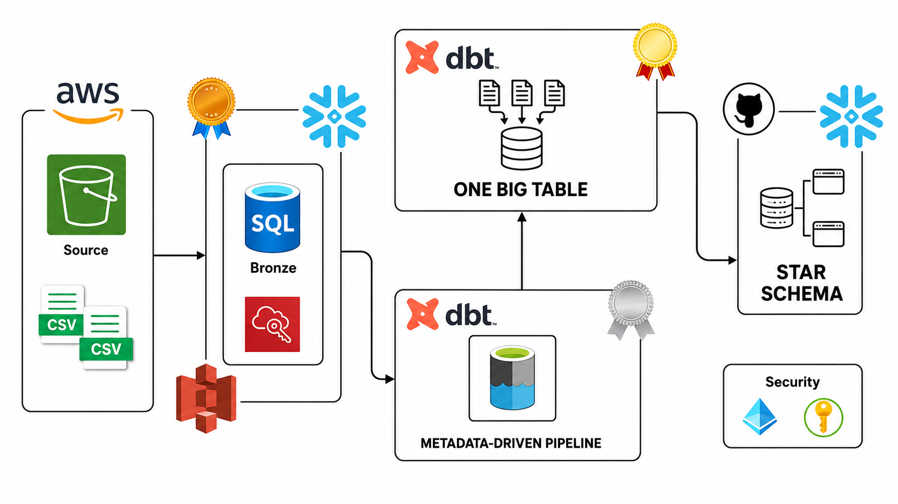
*End-to-end pipeline architecture — AWS S3 → Snowflake Staging → dbt Bronze / Silver / Gold medallion layers*

---

## Project Structure

```
airbnb-datapipeline-dbt/
│
├── Source_Data/                        # Raw CSV source files uploaded to AWS S3
│   ├── hosts.csv
│   ├── listings.csv
│   └── bookings.csv
│
├── DDL/                                # One-time Snowflake setup scripts
│   ├── ddl.sql                         # CREATE TABLE for staging entities
│   └── resources.sql                   # FILE FORMAT, STAGE, and COPY INTO from S3
│
├── aws_snowflake_dbt_project/          # dbt project root
│   ├── dbt_project.yml                 # Global project config and layer materialisation
│   ├── profiles.yml                    # Snowflake connection (gitignored)
│   ├── .user.yml                       # Local user-level dbt preferences
│   │
│   ├── models/
│   │   ├── sources/
│   │   │   └── sources.yml             # Declares AIRBNB.STAGING as dbt source
│   │   ├── bronze/
│   │   │   ├── bronze_hosts.sql        # Incremental load from staging.hosts
│   │   │   ├── bronze_listings.sql     # Incremental load from staging.listings
│   │   │   └── bronze_bookings.sql     # Incremental load from staging.bookings
│   │   ├── silver/
│   │   │   ├── silver_hosts.sql        # Cleansed hosts + RESPONSE_RATE banding
│   │   │   ├── silver_listings.sql     # Enriched listings + price tag macro
│   │   │   └── silver_bookings.sql     # TOTAL_AMOUNT computed via multiply macro
│   │   └── gold/
│   │       ├── obt.sql                 # One Big Table — Jinja loop-joined Silver tables
│   │       ├── fact.sql                # Fact table joining OBT + dimension snapshots
│   │       └── ephemeral/
│   │           ├── hosts.sql           # Ephemeral CTE sliced from OBT
│   │           ├── listings.sql        # Ephemeral CTE sliced from OBT
│   │           └── bookings.sql        # Ephemeral CTE sliced from OBT
│   │
│   ├── macros/
│   │   ├── multiply.sql                # Rounds x * y to n decimal places
│   │   ├── tag.sql                     # Bins a numeric column into low/medium/high
│   │   └── generate_schema_name.sql    # Overrides dbt's default schema naming
│   │
│   ├── snapshots/
│   │   ├── dim_hosts.yml               # SCD Type 2 snapshot on ephemeral hosts
│   │   ├── dim_listings.yml            # SCD Type 2 snapshot on ephemeral listings
│   │   └── dim_bookings.yml            # SCD Type 2 snapshot on ephemeral bookings
│   │
│   └── tests/
│       └── source_tests.sql            # Data quality test on staging.bookings
│
├── pyproject.toml                      # uv project manifest (Python 3.12, dbt deps)
├── uv.lock                             # Locked dependency graph
├── .gitignore
└── README.md
```

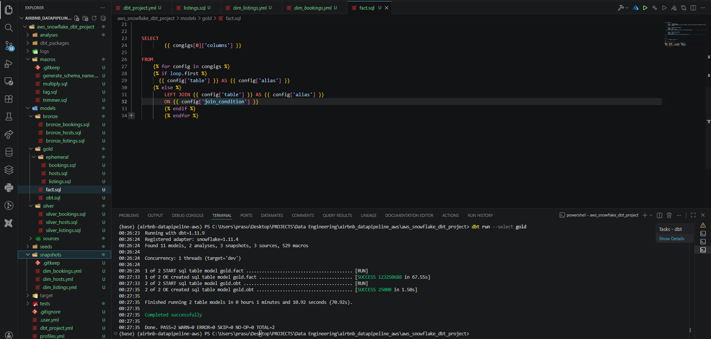
*VSCode workspace showing the full dbt project tree alongside a successful `dbt run --select gold` terminal output — 2 models built in 70s*

---

## Source Data & DDL

### Source Files (AWS S3)

The `Source_Data/` folder contains three CSVs representing the Airbnb domain entities. These files are manually uploaded to an S3 bucket and are the ultimate origin of all data in this pipeline.

| File | Entity | Key Columns |
|---|---|---|
| `hosts.csv` | Property owners | `host_id`, `host_name`, `host_since`, `is_superhost`, `response_rate`, `created_at` |
| `listings.csv` | Properties listed for rent | `listing_id`, `host_id`, `property_type`, `room_type`, `city`, `country`, `price_per_night`, `created_at` |
| `bookings.csv` | Guest reservations | `booking_id`, `listing_id`, `booking_date`, `nights_booked`, `booking_amount`, `service_fee`, `cleaning_fee`, `booking_status`, `created_at` |

These files are not consumed by dbt directly. They are first loaded into Snowflake's `STAGING` schema via the S3 integration defined in `DDL/resources.sql`. From there, `DDL/ddl.sql` and `sources.yml` are the bridge into the dbt lineage graph.

---

### DDL — Staging Tables

`DDL/ddl.sql` defines the three `STAGING` schema tables in Snowflake that mirror the CSV structure exactly. These tables are the **dbt source** — they are declared in `models/sources/sources.yml` and referenced throughout the Bronze layer with `{{ source('staging', 'table_name') }}`.

```sql
-- DDL/ddl.sql

CREATE OR REPLACE TABLE HOSTS (
    host_id       NUMBER        PRIMARY KEY,
    host_name     STRING,
    host_since    DATE,
    is_superhost  BOOLEAN,
    response_rate NUMBER,
    created_at    TIMESTAMP
);

CREATE OR REPLACE TABLE LISTINGS (
    listing_id      NUMBER    PRIMARY KEY,
    host_id         NUMBER,
    property_type   STRING,
    room_type       STRING,
    city            STRING,
    country         STRING,
    accommodates    NUMBER,
    bedrooms        NUMBER,
    bathrooms       NUMBER,
    price_per_night NUMBER,
    created_at      TIMESTAMP
);

CREATE OR REPLACE TABLE BOOKINGS (
    booking_id     STRING    PRIMARY KEY,
    listing_id     NUMBER,
    booking_date   TIMESTAMP,
    nights_booked  NUMBER,
    booking_amount NUMBER,
    cleaning_fee   NUMBER,
    service_fee    NUMBER,
    booking_status STRING,
    created_at     TIMESTAMP
);
```

---

### DDL — AWS–Snowflake Connection

`DDL/resources.sql` establishes the native Snowflake external stage that points directly at the S3 bucket, making the CSV files queryable from inside Snowflake without any third-party ETL tool.

**Step 1 — Define a CSV file format:**
```sql
CREATE OR REPLACE FILE FORMAT csv_format
  TYPE                      = 'CSV'
  FIELD_DELIMITER           = ','
  SKIP_HEADER               = 1
  ERROR_ON_COLUMN_COUNT_MISMATCH = FALSE;
```

**Step 2 — Create an external stage pointing at S3:**
```sql
CREATE OR REPLACE STAGE snowstage
  FILE_FORMAT = csv_format
  URL         = 's3://your-bucket-name/path/';
```

**Step 3 — Bulk-load each CSV into its staging table:**
```sql
COPY INTO HOSTS
FROM @snowstage
FILES      = ('hosts.csv')
CREDENTIALS = (
    aws_key_id     = 'YOUR_ACCESS_KEY_ID',
    aws_secret_key = 'YOUR_SECRET_ACCESS_KEY'
);

-- Repeat for LISTINGS and BOOKINGS
```

This approach uses Snowflake's own `COPY INTO` command — it compresses and loads data in parallel micro-partitions, and is far more efficient than row-by-row inserts from a Python script. No AWS Glue, no custom connector, no extra cost beyond standard Snowflake compute.

Once all three tables are populated, the `STAGING` schema is registered as a dbt source in `models/sources/sources.yml`:

```yaml
sources:
  - name: staging
    database: AIRBNB
    schema: staging
    tables:
      - name: listings
      - name: bookings
      - name: hosts
```

Every Bronze model references these sources directly via `{{ source('staging', 'hosts') }}` — meaning dbt tracks lineage from the raw S3-loaded tables all the way to the Gold FACT.

---

## Installation and Setup

### 1. Prerequisites

| Tool | Version | Purpose |
|---|---|---|
| Python | **3.12 exactly** | dbt-snowflake requires ≥ 3.12; earlier versions will fail at dependency resolution |
| uv | latest | Fast, lockfile-aware package and virtualenv manager |
| Snowflake account | Free trial works | Target warehouse — `AIRBNB` database, `COMPUTE_WH` warehouse |
| AWS account | Free tier sufficient | Hosts the source CSV files in an S3 bucket |

> **Python version is strict.** `dbt-snowflake>=1.11.4` resolves native Snowflake connector wheels that require Python 3.12. If your system Python is older, install 3.12 via `pyenv` or the official installer before proceeding.

---

### 2. Clone & Bootstrap with uv

`uv` replaces `pip + virtualenv` in a single command. It reads `pyproject.toml`, creates a `.venv` at the project root, and installs the exact locked versions from `uv.lock`.

```bash
# 1. Clone the repository
git clone https://github.com/PrasunDutta007/Airbnb-Datapipeline-dbt.git
cd Airbnb-Datapipeline-dbt

# 2. Install uv (if not already installed)
pip install uv

# 3. Create the virtual environment and install all dependencies
#    uv reads pyproject.toml - dbt-core and dbt-snowflake are declared there
uv sync

# 4. Activate the environment
# macOS / Linux
source .venv/bin/activate

# Windows PowerShell
.venv\Scripts\Activate.ps1
```

`pyproject.toml` declares the two direct dependencies:

```toml
[project]
name            = "airbnb-datapipeline-aws"
requires-python = ">=3.12"
dependencies    = [
    "dbt-core>=1.11.9",
    "dbt-snowflake>=1.11.4",
]
```

`uv.lock` pins every transitive dependency (560+ packages) - ensuring identical installs across machines and CI environments.

---

### 3. Configure Snowflake Connection — profiles.yml

dbt connects to Snowflake via a **profiles.yml** file. By default dbt looks for this at `~/.dbt/profiles.yml` (your home directory). For this project it is also stored inside the dbt project root for convenience — but is **gitignored** to protect credentials.

```yaml
# aws_snowflake_dbt_project/profiles.yml
aws_snowflake_dbt_project:
  target: dev
  outputs:
    dev:
      type: snowflake
      account: your_account_identifier   # e.g. abc12345.us-east-1
      user: your_snowflake_username
      password: your_snowflake_password
      role: ACCOUNTADMIN                 # or a custom role with USAGE on AIRBNB db
      database: AIRBNB
      warehouse: COMPUTE_WH
      schema: dev                        # default schema; overridden per-layer by dbt_project.yml
      threads: 1
```

**Why `profiles.yml` is critical:** the `profile` key in `dbt_project.yml` (`profile: 'aws_snowflake_dbt_project'`) must match the top-level key in `profiles.yml` exactly. A mismatch causes `dbt debug` to fail before any model runs.

---

### 4. Initialise dbt & Verify Connection

```bash
cd aws_snowflake_dbt_project

# Verify Snowflake connectivity — checks all profile fields and warehouse access
dbt debug

# Install any dbt packages (none currently, but good habit)
dbt deps

# Run the full pipeline — all layers in dependency order
dbt run

# Run only a specific layer
dbt run --select bronze
dbt run --select silver
dbt run --select gold

# Build snapshots (SCD Type 2 dimensions)
dbt snapshot

# Execute data quality tests
dbt test
```

---

### 5. dbt_project.yml — Global Model Configuration

`dbt_project.yml` is the heartbeat of the project. It tells dbt where to find every type of file and — critically — what materialisation strategy each layer uses by default:

```yaml
name: 'aws_snowflake_dbt_project'
profile: 'aws_snowflake_dbt_project'

model-paths:    ["models"]
macro-paths:    ["macros"]
snapshot-paths: ["snapshots"]
test-paths:     ["tests"]
seed-paths:     ["seeds"]

models:
  aws_snowflake_dbt_project:
    bronze:
      +materialized: table
      +schema: bronze          # resolves to AIRBNB.BRONZE via generate_schema_name macro
    silver:
      +materialized: table
      +schema: silver
    gold:
      +materialized: table
      +schema: gold
      ephemeral:
        +materialized: ephemeral   # no table written; inlined as CTE at query time
```

The `generate_schema_name` macro (in `macros/generate_schema_name.sql`) overrides dbt's default behaviour of prepending the target schema to every custom schema. Without it, dbt would produce `DBT_BRONZE` instead of the clean `BRONZE` schema name:

```sql

    
        {{ target.schema }}
    
        {{ custom_schema_name | trim }}
    

```

---

## Pipeline Walkthrough

```
Source_Data/ (CSV)
    │
    │  [One-time] DDL/resources.sql — S3 Stage + COPY INTO
    ▼
AIRBNB.STAGING.{hosts, listings, bookings}
    │
    │  [dbt] sources.yml → {{ source(...) }}
    ▼
AIRBNB.BRONZE.{bronze_hosts, bronze_listings, bronze_bookings}
    │  Materialization: incremental table
    │  Logic: SELECT * + watermark filter on CREATED_AT
    ▼
AIRBNB.SILVER.{silver_hosts, silver_listings, silver_bookings}
    │  Materialization: incremental table
    │  Logic: transformations, macros, response rate banding
    ▼
AIRBNB.GOLD.OBT  (One Big Table — 25 columns, Jinja loop joins)
    │
    ├──► Ephemeral hosts / listings / bookings  (no-materialise CTEs)
    │         │
    │         ▼
    │    AIRBNB.GOLD.{DIM_HOSTS, DIM_LISTINGS, DIM_BOOKINGS}
    │    (dbt snapshots — SCD Type 2, valid_to = 9999-12-31)
    │
    └──► AIRBNB.GOLD.FACT
         (Star Schema — OBT metrics + dimension snapshot joins)
```

---

## Deep Dive — Pipeline Layers

---

### 1. Bronze Layer — Raw Incremental Ingestion

The Bronze layer is the first dbt-managed stop after staging. Its only job is to land data faithfully from `STAGING` into `BRONZE` with no transformations — and to do so incrementally so re-runs are cheap.

All three models follow the same pattern:

```sql
-- models/bronze/bronze_hosts.sql
{{ config(materialized='incremental') }}

SELECT * FROM {{ source('staging', 'hosts') }}


    WHERE CREATED_AT > (
        SELECT COALESCE(MAX(CREATED_AT), '1900-01-01') FROM {{ this }}
    )

```

**How incremental works here:** on the very first run dbt materialises the full result as a table. On every subsequent run, the `` block activates and filters the source down to only rows newer than the latest `CREATED_AT` already in the Bronze table — appending only net-new records. The watermark `COALESCE(MAX(...), '1900-01-01')` ensures the filter is safe even on an empty table.

**Why `SELECT *` in Bronze:** Bronze is intentionally a raw copy. Column-level transforms belong in Silver, not here. This ensures the Bronze table can always re-derive Silver from scratch without touching the source, and makes schema evolution trivial — adding a column to the CSV requires only a DDL `ALTER TABLE` on the staging table, and Bronze picks it up automatically.

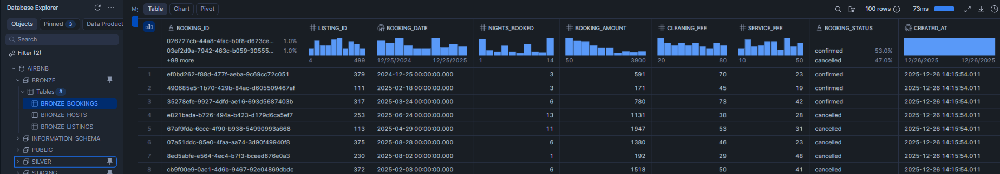
*`AIRBNB.BRONZE.BRONZE_BOOKINGS` — raw booking records as loaded from staging, no transforms applied*

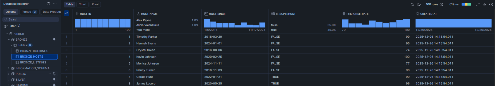
*`AIRBNB.BRONZE.BRONZE_HOSTS` — raw host records incrementally appended from `STAGING.HOSTS`*

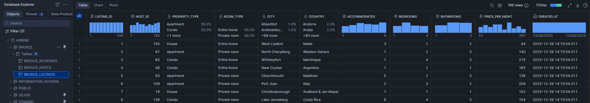
*`AIRBNB.BRONZE.BRONZE_LISTINGS` — raw listing records including all property and pricing fields*

---

### 2. Silver Layer — Cleansed & Enriched

Silver models read from Bronze using `{{ ref('bronze_...') }}` — enforcing lineage — and apply business-level transformations. All three models are also incremental, keyed on their natural primary key.

#### `silver_hosts.sql`

```sql
{{ config(materialized='incremental', unique_key='HOST_ID') }}

SELECT
    HOST_ID,
    REPLACE(HOST_NAME, ' ', '_') AS HOST_NAME,   -- normalise whitespace
    HOST_SINCE,
    IS_SUPERHOST,
    RESPONSE_RATE,
    CASE
        WHEN RESPONSE_RATE > 95 THEN 'VERY GOOD'
        WHEN RESPONSE_RATE > 80 THEN 'GOOD'
        WHEN RESPONSE_RATE > 60 THEN 'FAIR'
        ELSE 'POOR'
    END AS RESPONSE_RATE_QUALITY,
    CREATED_AT
FROM {{ ref('bronze_hosts') }}
```

`HOST_NAME` spaces are replaced with underscores for downstream join safety. `RESPONSE_RATE_QUALITY` buckets the raw numeric score into four human-readable bands — this derived column is surfaced all the way into the Fact table.

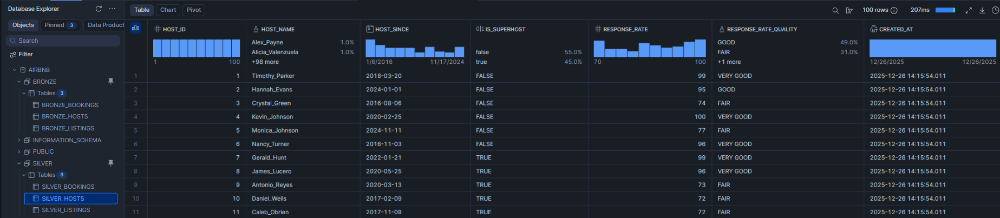
*`AIRBNB.SILVER.SILVER_HOSTS` — `HOST_NAME` normalised and `RESPONSE_RATE` banded into `RESPONSE_RATE_QUALITY` (VERY GOOD / GOOD / FAIR / POOR)*

#### `silver_listings.sql`

```sql
{{ config(materialized='incremental', unique_key='LISTING_ID') }}

SELECT
    LISTING_ID, HOST_ID, PROPERTY_TYPE, ROOM_TYPE,
    CITY, COUNTRY, ACCOMMODATES, BEDROOMS, BATHROOMS,
    PRICE_PER_NIGHT,
    {{ tag('CAST(PRICE_PER_NIGHT AS INT)') }} AS PRICE_PER_NIGHT_TAG,
    CREATED_AT
FROM {{ ref('bronze_listings') }}
```

The `{{ tag(...) }}` macro bins `PRICE_PER_NIGHT` into `low` / `medium` / `high` — a reusable classification that appears on both the Silver table and the downstream OBT. See [Macros](#macros) for the implementation.

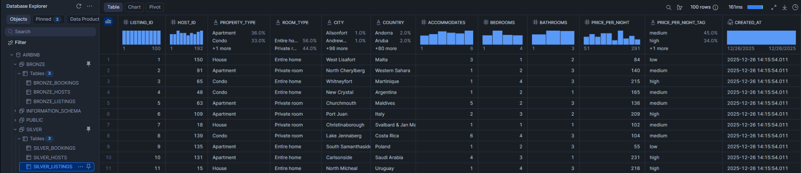
*`AIRBNB.SILVER.SILVER_LISTINGS` — `PRICE_PER_NIGHT_TAG` derived via the `{{ tag() }}` macro, classifying nightly rates as low / medium / high*

#### `silver_bookings.sql`

```sql
{{ config(materialized='incremental', keys='BOOKING_ID') }}

SELECT
    BOOKING_ID, LISTING_ID, BOOKING_DATE,
    {{ multiply('NIGHTS_BOOKED', 'BOOKING_AMOUNT', 2) }} AS TOTAL_AMOUNT,
    SERVICE_FEE, CLEANING_FEE, BOOKING_STATUS, CREATED_AT
FROM {{ ref('bronze_bookings') }}
```

`TOTAL_AMOUNT` — the true cost of a stay — is computed as `NIGHTS_BOOKED × BOOKING_AMOUNT` via the `{{ multiply() }}` macro, rounded to 2 decimal places. The raw `BOOKING_AMOUNT` in the source is a per-night rate; multiplying by nights gives the full booking value.

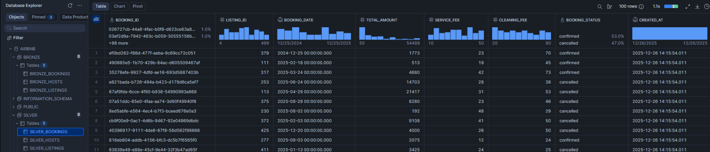
*`AIRBNB.SILVER.SILVER_BOOKINGS` — `TOTAL_AMOUNT` computed as `NIGHTS_BOOKED × BOOKING_AMOUNT` via the `{{ multiply() }}` macro*

---

### 3. Gold Layer — Analytics-Ready Models

The Gold layer is where all Silver entities converge. It produces four types of output: a One Big Table, ephemeral domain slices, SCD Type 2 dimension snapshots, and a Fact table.

#### One Big Table (OBT) — `obt.sql`

The OBT joins all three Silver entities into a wide, denormalised 25-column table. Rather than hardcoding the joins, the SQL is generated at compile time from a Jinja list of table configs — making it trivial to add a fourth entity without restructuring the query:

```sql
{% set configs = [
    {
        "table"  : "AIRBNB.SILVER.SILVER_BOOKINGS",
        "columns": "SILVER_bookings.*",
        "alias"  : "SILVER_bookings"
    },
    {
        "table"         : "AIRBNB.SILVER.SILVER_LISTINGS",
        "columns"       : "SILVER_listings.HOST_ID, SILVER_listings.PROPERTY_TYPE, ...",
        "alias"         : "SILVER_listings",
        "join_condition": "SILVER_bookings.listing_id = SILVER_listings.listing_id"
    },
    {
        "table"         : "AIRBNB.SILVER.SILVER_HOSTS",
        "columns"       : "SILVER_hosts.HOST_NAME, SILVER_hosts.RESPONSE_RATE_QUALITY, ...",
        "alias"         : "SILVER_hosts",
        "join_condition": "SILVER_listings.host_id = SILVER_hosts.host_id"
    }
] %}

SELECT
    
        {{ config['columns'] }},
    
FROM
    
        
            {{ config['table'] }} AS {{ config['alias'] }}
        
            LEFT JOIN {{ config['table'] }} AS {{ config['alias'] }}
            ON {{ config['join_condition'] }}
        
    
```

The OBT materialises as a full `table` in `AIRBNB.GOLD` with 25 columns and 25,000 rows — it is the single source of truth from which ephemeral slices and the Fact table are derived.

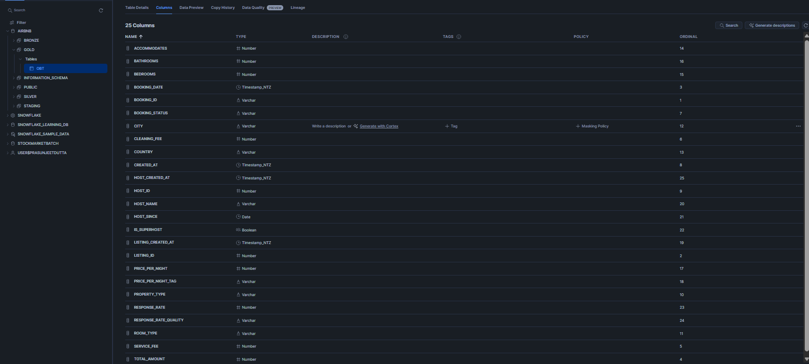
*`AIRBNB.GOLD.OBT` — 25-column denormalised table joining Silver Bookings, Listings, and Hosts via Jinja loop-generated SQL*

---

#### Ephemeral Models — Domain Slices

Three ephemeral models (`hosts.sql`, `listings.sql`, `bookings.sql`) slice the OBT into domain-specific column subsets. They are declared `materialized='ephemeral'` in `dbt_project.yml` and in their own `{{ config() }}` blocks — meaning dbt **never writes a table** for them. Instead, they are inlined as CTEs into any model that `ref()`s them.

Their sole purpose is to serve as the `relation:` targets for the three snapshot definitions. The snapshot engine reads from the ephemeral CTE at runtime, computes SCD Type 2 diffs, and writes the result directly to `AIRBNB.GOLD.DIM_*`:

```sql
-- models/gold/ephemeral/listings.sql
{{ config(materialized='ephemeral') }}

WITH listings AS (
    SELECT
        LISTING_ID, PROPERTY_TYPE, ROOM_TYPE,
        CITY, COUNTRY, PRICE_PER_NIGHT_TAG, LISTING_CREATED_AT
    FROM {{ ref('obt') }}
)
SELECT * FROM listings
```

**Why ephemeral?** Materialising intermediate models as views or tables would create unnecessary objects in Snowflake and pollute the Gold schema with transitional artefacts that analysts should never query directly. Ephemeral keeps the schema clean while preserving the lineage graph.

---

#### Fact Table — Star Schema

`fact.sql` assembles the Star Schema by joining the OBT's metric columns to the three dimension snapshots. The Jinja loop pattern from `obt.sql` is reused here — the table list and join conditions are config-driven:

```sql
{% set configs = [
    {
        "table"  : "AIRBNB.GOLD.OBT",
        "columns": "GOLD_obt.BOOKING_ID, GOLD_obt.LISTING_ID, GOLD_obt.HOST_ID,
                    GOLD_obt.TOTAL_AMOUNT, GOLD_obt.SERVICE_FEE, GOLD_obt.CLEANING_FEE,
                    GOLD_obt.ACCOMMODATES, GOLD_obt.BEDROOMS, GOLD_obt.BATHROOMS,
                    GOLD_obt.PRICE_PER_NIGHT, GOLD_obt.RESPONSE_RATE",
        "alias"  : "GOLD_obt"
    },
    {
        "table"         : "AIRBNB.GOLD.DIM_LISTINGS",
        "columns"       : "",
        "alias"         : "DIM_listings",
        "join_condition": "GOLD_obt.listing_id = DIM_listings.listing_id"
    },
    {
        "table"         : "AIRBNB.GOLD.DIM_HOSTS",
        "columns"       : "",
        "alias"         : "DIM_hosts",
        "join_condition": "GOLD_obt.host_id = DIM_hosts.host_id"
    }
] %}
```

The Fact table joins OBT booking metrics to `DIM_LISTINGS` and `DIM_HOSTS` — giving analysts a star schema with foreign-key relationships to the full SCD Type 2 dimension history. Only the OBT's columns are selected; the dimension tables provide the join context for downstream BI filters.

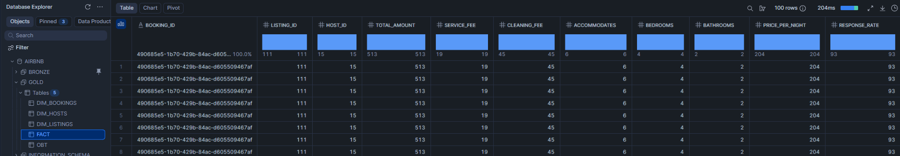
*`AIRBNB.GOLD.FACT` — Star Schema fact table surfacing 11 booking metric columns joined to `DIM_LISTINGS` and `DIM_HOSTS` snapshot dimensions*

---

## Jinja Templating

Jinja is not just a convenience in this project — it is the reason the SQL stays maintainable as the data model grows. dbt compiles every `.sql` file through Jinja before sending it to Snowflake, which means the SQL you write is a *template* that generates the final SQL at runtime. This enables three things that raw SQL simply cannot do cleanly: reusable logic (macros), conditional branching (incremental guards), and data-driven query generation (loop-built joins).

#### Conditional Logic — Incremental Guards

The most pervasive use of Jinja in this project is the `` block that appears in every Bronze and Silver model:

```sql

    WHERE CREATED_AT > (
        SELECT COALESCE(MAX(CREATED_AT), '1900-01-01') FROM {{ this }}
    )

```

`is_incremental()` is a dbt Jinja function that returns `True` only when the target table already exists and the model is being run in incremental mode. On a first run it returns `False`, so the full SELECT executes — building the table from scratch. On every subsequent run it returns `True`, injecting the WHERE clause that restricts processing to only new rows. Without Jinja, you would need two separate SQL files or a stored procedure to achieve this branching — Jinja collapses it into a single, readable template.

`{{ this }}` is another Jinja context variable that resolves to the fully-qualified name of the model's own table at runtime (`AIRBNB.BRONZE.BRONZE_HOSTS`, for example). Using `{{ this }}` instead of hardcoding the table name means the watermark query automatically adapts when the model is run against a different target (dev vs prod) without any code change.

#### Reference Resolution — `ref()` and `source()`

Every cross-model dependency in this project is expressed as `{{ ref('model_name') }}` or `{{ source('staging', 'table') }}` — never as hardcoded schema-qualified table names. At compile time, Jinja resolves these to the correct fully-qualified identifiers for the active target environment:

```sql
-- What you write
FROM {{ ref('bronze_hosts') }}

-- What dbt compiles it to
FROM AIRBNB.BRONZE.BRONZE_HOSTS
```

Beyond name resolution, `ref()` and `source()` are how dbt builds its **lineage DAG**. Every `ref()` call creates a directed edge in the dependency graph — so when you run `dbt run --select silver_bookings+`, dbt knows to run `bronze_bookings` first, then `silver_bookings`, then everything downstream. Without these Jinja functions, dbt cannot infer execution order and the lineage panel in your data catalog goes dark.

#### Data-Driven SQL Generation — Loop Joins in OBT and Fact

The most architecturally significant Jinja in the project is the loop-driven SQL in `obt.sql` and `fact.sql`. Instead of writing JOIN clauses by hand, a Python-style list of table configs drives the entire SELECT and FROM/JOIN block:

```sql


SELECT
    
        {{ config['columns'] }},
    
FROM
    
        
            {{ config['table'] }} AS {{ config['alias'] }}
        
            LEFT JOIN {{ config['table'] }} AS {{ config['alias'] }}
            ON {{ config['join_condition'] }}
        
    
```

The compiled output is standard SQL — Snowflake never sees the Jinja. But the *source* is configuration, not repetition. Adding a fourth entity to the OBT means appending one dict to the `configs` list. Removing one means deleting a dict. There is no risk of forgetting to update a SELECT column list when you change a JOIN, because the column list and the JOIN are defined in the same config object. This is the pattern that separates a maintainable data model from one that becomes a liability at scale.

#### Why This Matters Beyond This Project

Jinja in dbt reflects a broader engineering principle: **SQL is data, not just a query language**. Treating SQL as a text template that can be parameterised, conditionally branched, and loop-generated gives you the same maintainability that application engineers rely on — DRY (Don't Repeat Yourself), separation of config from logic, and environment portability. Comfort with Jinja at this depth signals readiness for dbt's most advanced patterns: dynamic model generation, cross-project refs, and package authoring.

---

## Macros

Three custom macros live in `macros/` and are used across the Silver and Gold layers.

#### `multiply.sql` — Precision arithmetic

Used in `silver_bookings.sql` to compute `TOTAL_AMOUNT` from per-night rate and number of nights:

```sql

    round({{ x }} * {{ y }}, {{ precision }})

```

Call: `{{ multiply('NIGHTS_BOOKED', 'BOOKING_AMOUNT', 2) }}`
Compiles to: `round(NIGHTS_BOOKED * BOOKING_AMOUNT, 2)`

---

#### `tag.sql` — Numeric banding

Used in `silver_listings.sql` to classify `PRICE_PER_NIGHT` into a human-readable tier:

```sql

    CASE
        WHEN {{ col }} < 100 THEN 'low'
        WHEN {{ col }} < 200 THEN 'medium'
        ELSE 'high'
    END

```

Call: `{{ tag('CAST(PRICE_PER_NIGHT AS INT)') }}`
Compiles to the full CASE expression inline — no view overhead, no UDF dependency.

---

#### `generate_schema_name.sql` — Clean schema routing

Without this override, dbt prefixes every custom schema with the target schema from `profiles.yml`, producing names like `DEV_BRONZE`. This macro eliminates the prefix so models land in `BRONZE`, `SILVER`, and `GOLD` exactly as declared in `dbt_project.yml`:

```sql

    
        {{ target.schema }}
    
        {{ custom_schema_name | trim }}
    

```

---

## Snapshots — SCD Type 2

The three snapshot definitions in `snapshots/` convert ephemeral domain slices into full Slowly Changing Dimension tables with dbt-managed validity tracking. Running `dbt snapshot` processes all three. Each snapshot:

1. Reads from its `relation:` (an ephemeral model referencing the OBT)
2. Compares the current state to the previous snapshot using the `updated_at` timestamp
3. Writes new version rows for changed records and keeps existing rows immutable
4. Sets `DBT_VALID_TO = '9999-12-31'` on the currently active version of every record

```yaml
# snapshots/dim_listings.yml
snapshots:
  - name: dim_listings
    relation: ref('listings')       # reads from the ephemeral listings CTE
    config:
      schema: gold
      database: AIRBNB
      unique_key: LISTING_ID
      strategy: timestamp
      updated_at: LISTING_CREATED_AT
      dbt_valid_to_current: "to_date('9999-12-31')"
```

dbt adds four system columns to every snapshot table:

| Column | Meaning |
|---|---|
| `DBT_SCD_ID` | Unique surrogate key for each version row |
| `DBT_UPDATED_AT` | Timestamp of when this version was created |
| `DBT_VALID_FROM` | Start of this record's validity window |
| `DBT_VALID_TO` | End of validity — `9999-12-31` for the current active row |

This gives the Gold schema full historical dimension tables — analysts can filter `WHERE DBT_VALID_TO = '9999-12-31'` for current state, or use `BETWEEN DBT_VALID_FROM AND DBT_VALID_TO` for point-in-time queries.

```bash
# Build snapshots independently
dbt snapshot

# Or target a specific one
dbt snapshot --select dim_hosts
```

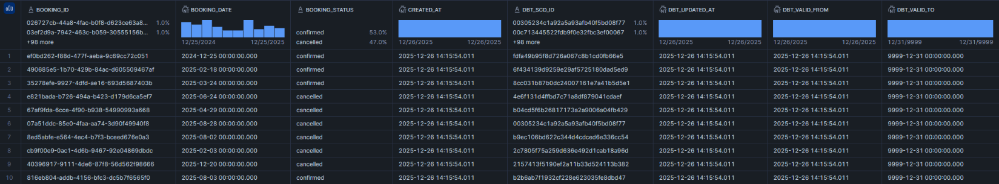
*`AIRBNB.GOLD.DIM_BOOKINGS` — SCD Type 2 snapshot with dbt-managed `DBT_SCD_ID`, `DBT_VALID_FROM`, and `DBT_VALID_TO` columns; active rows carry `DBT_VALID_TO = 9999-12-31`*

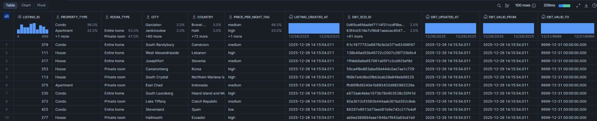
*`AIRBNB.GOLD.DIM_LISTINGS` — SCD Type 2 snapshot tracking historical changes to listing attributes including `PRICE_PER_NIGHT_TAG`*

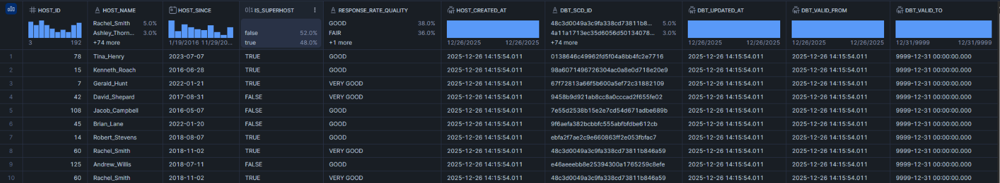
*`AIRBNB.GOLD.DIM_HOSTS` — SCD Type 2 snapshot preserving full history of host response rate changes; `RESPONSE_RATE_QUALITY` bands are versioned alongside the raw score*

---

## Testing

`tests/source_tests.sql` implements a custom dbt singular test that checks booking data quality directly against the `STAGING` source:

```sql
{{ config(severity='warn') }}

SELECT 1
FROM {{ source('staging', 'bookings') }}
WHERE BOOKING_AMOUNT < 200
```

This test returns one row per suspicious booking (amount under 200) and is configured with `severity='warn'` — meaning `dbt test` completes successfully but surfaces a warning with the count of affected rows rather than failing the pipeline. This is appropriate for a data quality signal that analysts should be aware of but that shouldn't block model execution.

```bash
dbt test
```

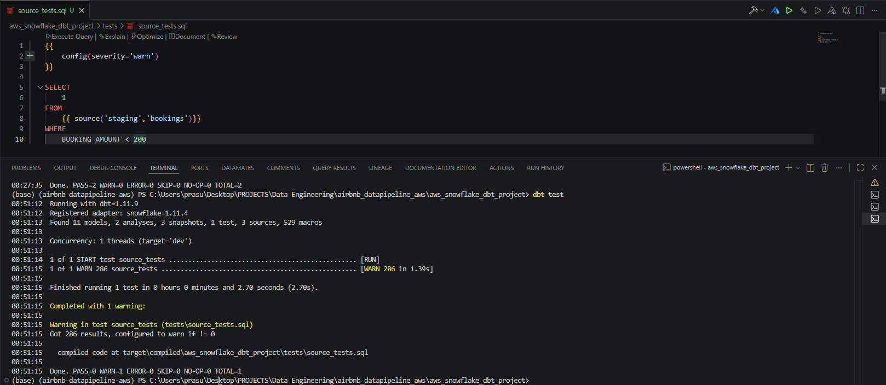
*`dbt test` output — 286 bookings with `BOOKING_AMOUNT < 200` flagged as `WARN 286`; pipeline completes with `PASS=0 WARN=1 ERROR=0`, intentionally non-blocking*

---

## Key Engineering Decisions

| Decision | Rationale |
|---|---|
| AWS S3 External Stage over Python ETL | Snowflake's native `COPY INTO` uses parallel micro-partition loading — faster and cheaper than any Python-based row-by-row insert, and eliminates an entire infrastructure component |
| Incremental models at every layer | Avoids full table rebuilds on each `dbt run`; only net-new rows (by `CREATED_AT` watermark) are processed, keeping compute costs predictable as data volume grows |
| `unique_key` in Silver incremental models | Enables `MERGE` upsert semantics in Silver — if a record is corrected upstream and re-ingested, Silver reflects the update rather than duplicating it |
| `SELECT *` in Bronze | Bronze is a faithful mirror of staging; transforms belong in Silver. This makes schema evolution safe — new columns flow through automatically without touching Bronze SQL |
| Jinja loop-driven SQL in OBT and Fact | Adding a fourth domain entity requires only appending one dict to the Jinja `configs` list — the SELECT and JOIN clauses regenerate at compile time. No copy-paste SQL maintenance |
| Ephemeral models as snapshot inputs | Keeps the Gold schema clean (no intermediate tables visible to analysts) while giving dbt's snapshot engine a named `ref()` target to diff against. No temp tables, no extra Snowflake storage |
| `dbt_valid_to_current = '9999-12-31'` | Industry-standard sentinel date for "currently active" dimension records. Makes current-state queries simple (`WHERE DBT_VALID_TO = '9999-12-31'`) and avoids NULL handling in BI tools |
| `severity='warn'` on source tests | Data quality signals should never silently vanish (no test = bad) but also shouldn't block model execution on a business condition that may be expected (low-value bookings exist). Warn is the correct middle ground |
| `generate_schema_name` macro override | Without it, dbt adds the target schema as a prefix to every custom schema (e.g. `DEV_BRONZE`). The override produces clean, environment-independent schema names (`BRONZE`, `SILVER`, `GOLD`) consistent across dev and prod targets |
| uv over pip + venv | `uv sync` resolves, downloads, and installs 560+ transitive dependencies in seconds with full lockfile reproducibility — critical for a project with the complex dependency tree of `dbt-snowflake` |
| Python 3.12 strict requirement | `dbt-snowflake>=1.11.4` ships pre-compiled Snowflake connector wheels only for Python 3.9–3.12. Using 3.12 ensures forward compatibility with the latest connector features and avoids build-from-source failures on older interpreters |

---

*Built by Prasun Dutta*

---
